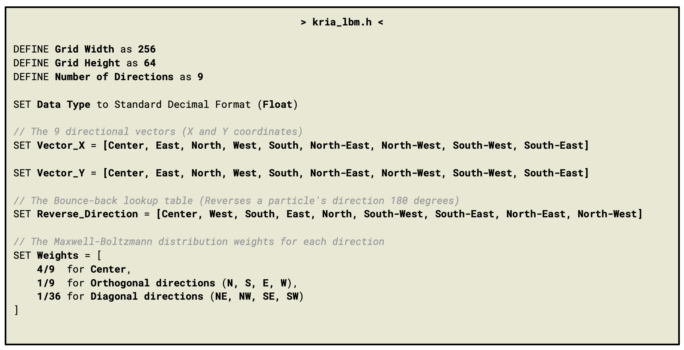
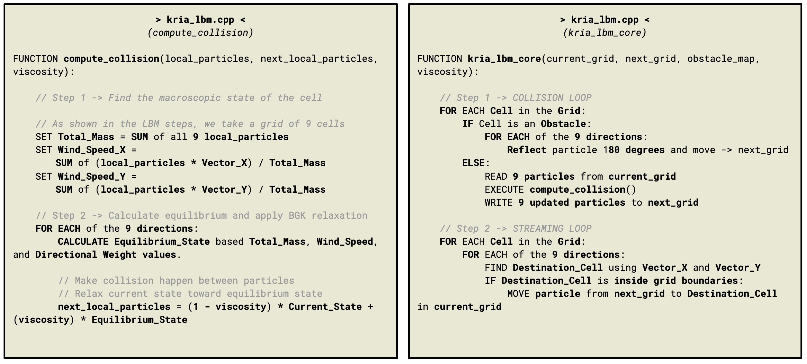
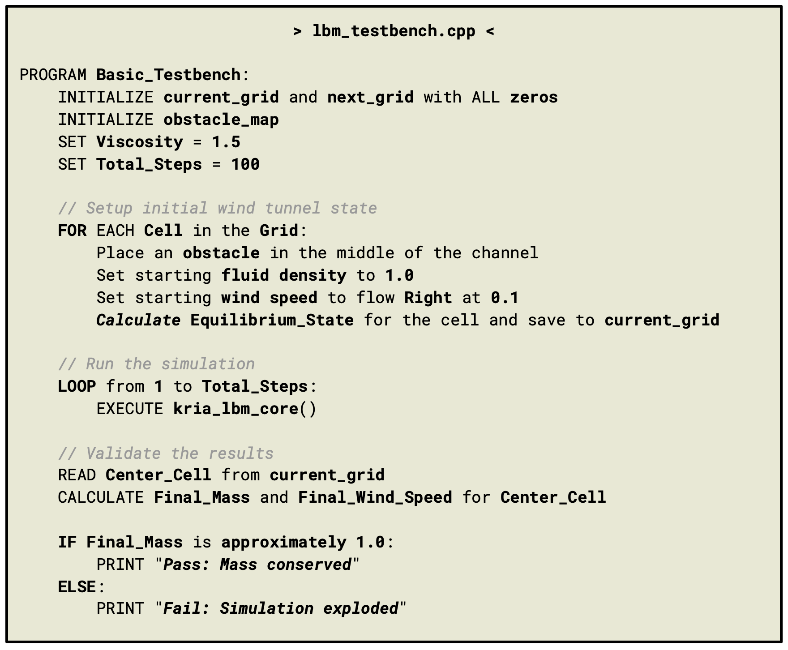
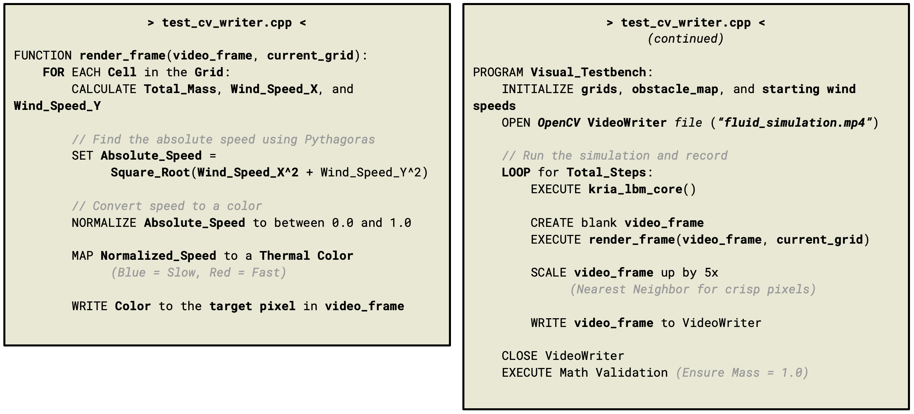
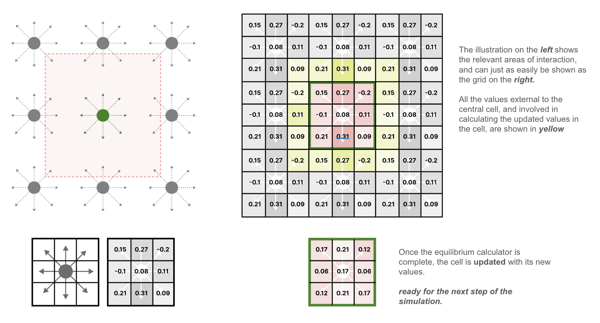

# Kria-LBM: FPGA Accelerated Fluid Simulation

## Project Overview

This project implements a high-performance computational fluid dynamics (CFD) simulation on the AMD Kria KV260 System-on-Module. It leverages the **Lattice Boltzmann Method (LBM)** and the **D2Q9 velocity set** to simulate fluid flow.

The core physics engine is written in C++ and synthesized into a custom hardware IP block using **AMD Vitis HLS**. The host application and visualization are handled by the Kria's ARM processor using Python and the PYNQ framework.

<p align="center">
  
</p>

_The custom LBM fluid simulation, currently executed using CPU and before HLS pragmas are impelemnted for FPGA hardware acceleration._
_Running at 300fps, with 'dual pillar' obstacles and an omega of 1.93_

## Project Status

### Phase 1: Architecture

- **Algorithm Pivot:** Traditional macroscopic fluid solvers (such as Eulerian Navier-Stokes or Gauss-Seidel relaxation) were discarded. The Lattice Boltzmann Method was selected because the core operations (Stream and Collide) are highly localized, making the algorithm ideally suited for DSP slices and hardware pipelining.
- **Hardware Scale Limits:** The initial prototype is constrained to a **256x64 grid** to ensure the entire environment fits safely within the Kria's internal BRAM/URAM capacity, bypassing DDR4 memory bottlenecks.
- **Separation of Concerns:** The FPGA is strictly reserved for executing the LBM physics. Peripheral tasks (sensor telemetry, UI rendering) are delegated to C++ threads executed on the ARM processor.

### Phase 2: Software Baseline

- **Data Structures:** The D2Q9 physics constants, velocity vectors, and grid limits have been defined in the core header file.

<p align="center">
  
</p>

- **Physics Engine:** The localized BGK collision mathematics (calculating macroscopic density/velocity, equilibrium distribution, and relaxation) have been successfully implemented.

<p align="center">
  
</p>

- **CPU Testbench:** A basic C++ testing environment has been established to allocate heap memory and verify mathematical execution on the CPU prior to hardware synthesis.

<p align="center">
  
</p>

<p align="center">
  
</p>

### Phase 3: Boundary & Obstacle Mechanics

- **Bounce-Back Boundaries:** A hardware-optimized bounce-back mechanism was integrated into the primary execution loop. Solid cells accurately invert particle distribution populations by 180 degrees using direct array pointer routing, requiring zero floating-point math overhead.
- **Obstacle Verification:** A flat plate obstruction was placed into the simulation path within the testbench framework. The verification confirmed stable fluid routing, physical wake formation downstream, and absolute mass conservation.

## Hardware Architecture & Data Flow

To maximize throughput on the FPGA fabric, the data flow dictates a strictly localized, two-phase operation utilizing a closed-loop memory architecture.

### 1. Ping-Pong Memory Buffer

The algorithm prevents memory read/write collisions by employing two distinct grid arrays in Block RAM (BRAM). The data flows in a continuous cycle:

- **Phase 1 (Collision):** The hardware reads the current state from `grid_f`, pulls the data into localized flip-flop registers, computes the BGK relaxation equations, and writes the post-collision state into `grid_new_f`.
- **Phase 2 (Streaming):** The hardware reads the post-collision data from `grid_new_f`, shifts the coordinates based on the 9 directional velocity vectors, and writes the updated data back into `grid_f`, readying the memory for the next time step.

### 2. Hardware-Optimized Boundary Conditions

<p align="center">
  
</p>

_(left) Interacting forces between D2Q9 cells and (right) how their relevant mass distrution interactions are highlighted (yellow squares) in order to calculate the updated mass distribution for the central cell (red squares)_

To simulate a continuous wind tunnel environment, Periodic Boundary Conditions are applied during the streaming phase. If a particle hits the side of the 256x64 grid, it immediately bounces off according to the standard object collision rules within the environment (particles reflect 180degrees).

- **Design Choice:** I removed the wraparound and instead use the edges of the scene as boundaries and use this to calcuate the fact that mass has been conserved.

## Baseline Validation Testing

The C++ software model was validated on the CPU using a uniform rightward-flowing wind tunnel initialization ($u_x = 0.1$, $\rho = 1.0$) across a 256x64 grid layout for 100 evaluation steps.

```bash
LBM Testbench started...
Fluid initialized. Running 100 iterations...
Fluid Simulation Ended.
--- Test Complete ---
Target Density:  1.00000  | Final Density:  1.00000
Target Velocity: 0.10000  | Final Velocity: 0.10000
RESULT: PASS (Mass conserved)
```

## Directory Structure

- `/src` - Contains the synthesizable C++ hardware kernel and headers (`kria_lbm.cpp`, `kria_lbm.h`).
- `/tb` - Contains the C++ testbench used strictly for CPU-based math verification (`lbm_testbench.cpp`).
- `/host` - Contains the Python control scripts and visualization utilities.
- `/data` - Contains generated obstacle maps (e.g., airfoil coordinates) and benchmark outputs.
- `/samples` - Contains the sources for imagery from any of the documentation.

## Next Steps

1. Define Pragmas and begin the process of converting to parallel execution.
